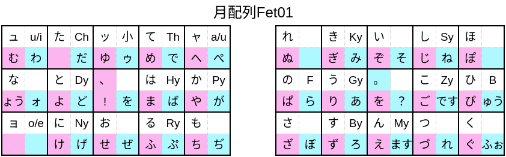
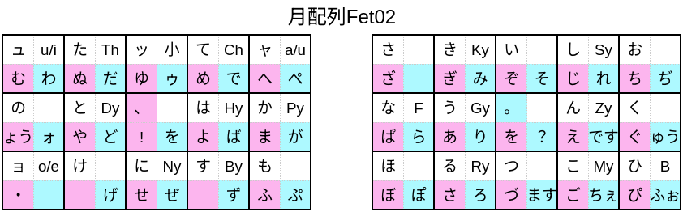
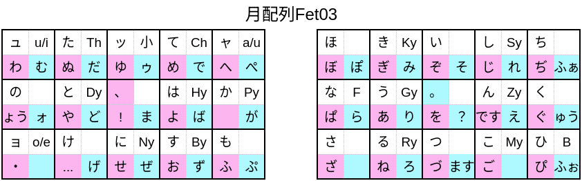

# 月配列Fet
月配列E-10,月配列E-x,ぶり中トロ配列をベースに作成した中指シフトハイブリッドかな配列です。  
## ver01
  
[定義ファイル](./GoogleIME/Tuki_Fet01.txt)  
## ver02
  
[定義ファイル](./GoogleIME/Tuki_Fet02.txt)  
## ver03
  
[定義ファイル](./GoogleIME/Tuki_Fet03.txt)  
